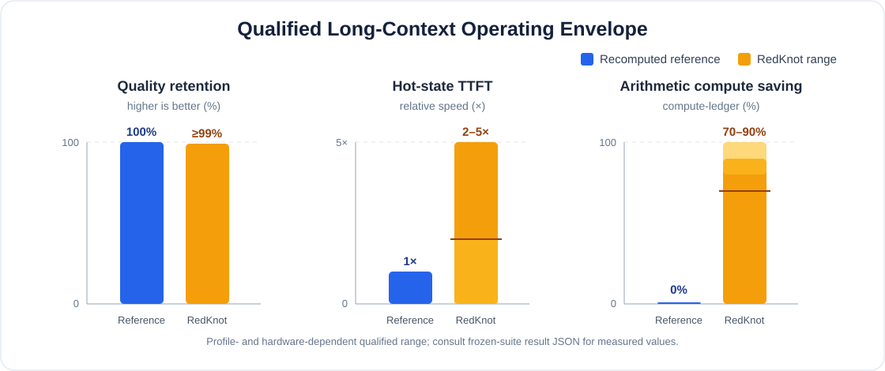

<div align="center" id="redknottop">
  

  <p><strong>Head-aware reuse and token-selective execution for long-context LLM serving.</strong></p>

  <p>
    <a href="https://github.com/sgl-project/sglang"></a>
    <a href="./LICENSE"></a>
    <a href="#deepseek-v4-flash-release"></a>
  </p>

  <p>
    <a href="#deepseek-v4-flash-release">Quick start</a> ·
    <a href="#what-is-redknot">Technology</a> ·
    <a href="#other-benchmark-entrypoints">Benchmarks</a> ·
    <a href="#partners">Partners</a> ·
    <a href="https://arxiv.org/abs/2606.06256">Paper</a>
  </p>
</div>

> **Research release.** RedKnot is an SGLang-based research system for long-context inference. Its kernels, policy contracts and supported models are actively evolving. Reproduce the frozen benchmark manifests before using a reported result to compare systems or hardware.

## Performance at a glance



On qualified long-context profiles, RedKnot targets quality regression within
**1 percentage point**, a **2–5× hot-state TTFT speedup**, and **70–90%
arithmetic compute-ledger saving**. Blue denotes the Recomputed reference;
yellow denotes the RedKnot operating envelope. The achieved point depends on
the model, context length, GPU topology and frozen policy; per-suite result
JSON is the source of truth.

The compute ledger intentionally excludes memory traffic, kernel-launch cost,
TP communication and all uncredited runtime components; it is therefore not a
claim about total system energy or universal end-to-end throughput.

## News

- **2026-08 — DeepSeek V4 Flash TP8 release.** This repository now includes a packaged DeepSeek-V4-Flash + RedKnot path with one-command reproduction over frozen 64K, 128K, 256K and 440K LongBench-derived RAG suites.
- **2026-07 — Lab-model adapters.** RedKnot released experimental adapters and RAG benchmarks for Mistral, Qwen3, Qwen3.5 MoE and Llama 3.3, covering native SWA, GQA/MHA head policies and sparse-FFN execution.
- **2026-06 — Paper.** [*RedKnot: Efficient Long-Context LLM Serving with Head-Aware KV Reuse and SegPagedAttention*](https://arxiv.org/abs/2606.06256) is available on arXiv.

## Future Work

- **September–October 2026 — Hybrid-architecture models.** We plan to publish
  adaptation results for the Qwen3.5-to-Qwen4 family and GLM-5.3. If there is
  another model you would like RedKnot to support, please
  [open an issue](https://github.com/rednote-machine-learning/RedKnot/issues).
- **DeepSeek V4 series.** We will continue supporting the DeepSeek V4 family,
  with DeepSeek V4 Pro adaptation coming soon.

## What is RedKnot?

RedKnot is a model-aware long-context execution framework built around three
composable ideas rather than one model-specific cache shortcut:

1. **Head decomposition and aggregation.** Attention heads are classified by
   their long-context behavior. Reusable local heads are prepared offline;
   global, retrieval or recovery heads remain online. Their projected
   contributions are merged back into the model without changing the model's
   external interface. The same abstraction maps to MLA, MHA, GQA and native
   sliding-window attention, with model-specific projection and RoPE handling.
2. **Sparse FFN and MoE execution.** Token-level importance controls which rows
   enter expensive FFN work, while adaptive expert Top-K assigns more experts
   only when the router distribution requires them. Dense boundary layers and
   protected query rows preserve the critical path.
3. **SegPagedAttention.** KV pages and visibility are organized per head and
   segment, allowing global, local and retrieval heads to consume different
   context scopes without forcing one uniform cache layout.

Together, these mechanisms reduce redundant work at the head, token and expert
levels. RedKnot keeps a full online Recomputed path as its reference; reported
gains are therefore measured against the same checkpoint and input IDs rather
than against a prefix-cache hit.

## DeepSeek V4 Flash release

The DeepSeek-V4-Flash release is the primary reproducible path in this repository. It runs on a TP8 server and ships all frozen inputs, head policy, sparse-MoE policy and execution manifests required for the packaged benchmark.

### Verified high-efficiency configuration

| Component | Frozen release setting |
|---|---|
| Model | `deepseek-ai/DeepSeek-V4-Flash-0731` |
| Hardware used for the published run | 8× NVIDIA H200, 143,771 MiB per GPU, TP8; driver 570.148.08 |
| Runtime | CPython 3.11.13, PyTorch 2.9.1 + CUDA 12.8, Triton 3.5.1 |
| Kernels | FlashMLA `1.0.0+9241ae3`, SGL Kernel 0.3.20, FlashInfer 0.5.3 |
| MLA policy | Layers 0–2 and 40–42 fully online; layers 3–39 use 8 online global heads and 56 reusable local heads, with online RoPE relocation and projection merge |
| Token and expert sparsity | Checkpoint-island row selection plus plan-scoped adaptive expert Top-K; cumulative router mass 0.50, physical Top-K buckets 3/4/5/6 |
| TTFT protocol | Hot state; 3 unmeasured paired warmups followed by 10 measured Recomputed/RedKnot pairs per case; streaming first output token, p50/p95 |

| Suite | Prompt-token target | Frozen document geometry | Runtime static-memory fraction |
|---|---:|---:|---:|
| 64K | 65,536 | 4 × 16,384 tokens | 0.45 |
| 128K | 131,072 | 4 × 32,768 tokens | 0.40 |
| 256K | 262,144 | 8 × 32,768 tokens | 0.45 |
| 440K | 450,560 | 8 × 56,320 tokens | 0.29 |

Each frozen suite contains 15 cases: 10 short-answer cases and 5 supplemental
30-token long-output cases. The Recomputed reference performs a complete
online prefill with no RedKnot prefix reuse; RedKnot materializes the first
document as the certified prefix and applies the published reuse, row-sparse
and adaptive-Top-K policy to the remaining documents.

All measurements and validation experiments in this repository were run on
8× NVIDIA H200 or 8× NVIDIA B300 nodes in TP8. No L20X/L20Y measurements are
reported. H200 uses the certified Hopper release configuration; B300 uses the
separate SM103 hardware profile and rebuilds the hardware-specific FlashMLA,
DeepGEMM and SGL kernels before running the same frozen suites.

### Quick start

```bash
git clone git@github.com:rednote-machine-learning/RedKnot.git
cd RedKnot/test/srt/redknot

# Creates or validates the pinned environment, then runs all four suites.
./run_deepseek_v4_flash_reproduction.sh
```

The wrapper uses the local DeepSeek-V4-Flash checkpoint by default. Set `REDKNOT_MODEL_PATH` or pass `--model-path` to select another checkpoint path. If the checkpoint is unavailable, the Python entrypoint can download the published model unless `--no-download-model` is set.

For a new shell on a prepared machine:

```bash
cd test/srt/redknot
./setup_deepseek_v4_flash_env.sh --check-only
source ./environment-deepseek-v4-flash.env
python benchmark_RedKnot_DeepSeekV4Flash.py
```

The default run is intentionally comprehensive and sequential: it needs the same eight GPUs for each suite and does not run two TP8 servers concurrently.

The suite order, SHA256 digests, TTFT contract and full result layout are documented in the [DeepSeek V4 Flash release guide](test/srt/redknot/README_DEEPSEEK_V4_FLASH.md).

## Other benchmark entrypoints

Alongside the DeepSeek-V4-Flash release path, the repository contains
model-specific RedKnot benchmark entrypoints for Mistral, Qwen and Llama:

| Family | Entry point | Status |
|---|---|---|
| Mistral | `benchmark_RedKnot_Mistral_RAG.py` | Native-SWA reuse benchmark |
| Qwen3 | `benchmark_RedKnot_Qwen3_RAG.py` | Head-aware RAG benchmark |
| Qwen3.5 MoE | `benchmark_RedKnot_Qwen35_RAG.py` | MoE benchmark; requires the pinned Transformers 5 environment |
| Llama 3.3 | `benchmark_RedKnot_Llama3.3_RAG.py` | Experimental; validate its model-specific result contract |

Run them from the release directory after installing the required model weights:

```bash
cd test/srt/redknot

# Mistral and Qwen3
python benchmark_RedKnot_Mistral_RAG.py
python benchmark_RedKnot_Qwen3_RAG.py

# Qwen3.5 MoE: use the pinned Transformers 5 environment
../../.venv_tf5/bin/python benchmark_RedKnot_Qwen35_RAG.py

# Llama 3.3: experimental path
python benchmark_RedKnot_Llama3.3_RAG.py
```

Each script owns its model-specific configuration, dataset and hardware
requirements. Do not compare their numbers directly with the DeepSeek V4 Flash
TP8 release unless their reported input, precision and measurement contract
match.

## Repository layout

```text
python/sglang/srt/layers/attention/redknot/   RedKnot runtime integration
test/srt/redknot/                             Benchmarks, release launcher and docs
test/srt/redknot/head_class/                  Frozen head-policy publication
test/srt/redknot/sparse_ffn_params/           Sparse-MoE policy publication
test/srt/redknot/datasets/                    LongBench inputs, suites and provenance
test/srt/redknot/server/                      TP8 server launcher and policy checks
```

## Partners

<p align="center">
  <a href="https://www.xiaohongshu.com"></a>
  &emsp;&emsp;
  <a href="https://www.pku.edu.cn"></a>
  &emsp;&emsp;
  <a href="https://www.huawei.com"></a>
  &emsp;&emsp;
  <a href="https://www.ubiquant.com"></a>
  &emsp;&emsp;
  
</p>

## Citation

If you use RedKnot, please cite the paper:
> Yang Liu, ZhaoKai Luo, HuaYi Jin, ZhiYong Wang, RuoZhou He, BoYu Wang, Guanjie Chen, and Junhao Hu. *RedKnot: Efficient Long-Context LLM Serving with Head-Aware KV Reuse and SegPagedAttention.* [arXiv:2606.06256](https://arxiv.org/abs/2606.06256).

## Acknowledgements & License

RedKnot is built on [SGLang](https://github.com/sgl-project/sglang) and benefits from the broader serving ecosystem, including [vLLM](https://github.com/vllm-project/vllm).

RedKnot is released under the [Apache License 2.0](LICENSE). Third-party components remain subject to their respective licenses and notices.
